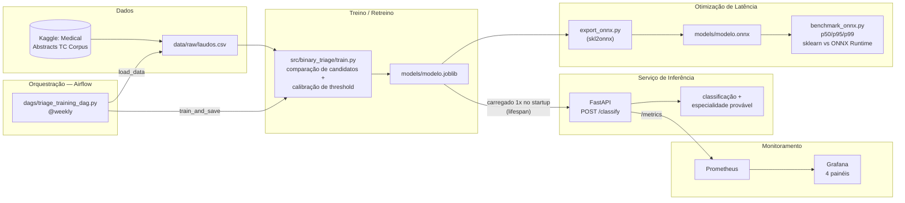

# medical-triage-mlops

Sistema de triagem automática de laudos médicos (NLP), servido via API REST em
container Docker, com pipeline de CI/CD (GitHub Actions), orquestração de
retreino (Airflow), monitoramento (Prometheus + Grafana) e otimização de
latência (ONNX). Projeto do **Tech Challenge — Fase 3** da FIAP Pós Tech em
Machine Learning Engineering.

Vídeo Explicativo (método STAR, ≤5 min): `[A PREENCHER]`

## Integrantes

| Nome | RM | Contato |
|--|--|--|
| Gustavo Dell Anhol Oliveira | RM372138 | [Github](https://github.com/gudaoliveira) - [Linkedin](https://www.linkedin.com/in/gustavodell/) |
| Patrick Kwan | RM373172 | [Github](https://github.com/ptkwan) - [Linkedin](https://www.linkedin.com/in/patrick-kwan-617296220/) |

## Contexto

Um hospital recebe laudos em texto livre e precisa decidir rapidamente se um
caso pode seguir para um **clínico geral** ou se deve ser encaminhado direto
para um **especialista** (oncologia, cardiologia, neurologia,
gastroenterologia). O `ThresholdedBinaryClassifier` treinado em
`src/binary_triage/train.py` automatiza essa primeira decisão e, quando o caso
é `ESPECIALISTA`, já indica a especialidade mais provável — reduzindo o tempo
até o laudo chegar na fila certa.

## Fluxo do projeto



Duas formas de mexer no sistema: **retreinar o modelo** (via DAG do Airflow ou
rodando `train.py` manualmente) ou **consumir a API** diretamente — a API
sempre carrega o `.joblib` mais recente no startup.

## Como rodar

Requisitos: Python 3.12 ou 3.13, **[uv](https://docs.astral.sh/uv/getting-started/installation/)**
para gerenciar dependências, e Docker + Docker Compose para subir a stack de
API + Prometheus + Grafana. Comandos de conveniência em `make help` (lint,
format, test) — ver `Makefile` para a lista completa.

```bash
# clonar o repositório
git clone https://github.com/gudaoliveira/medical-triage-mlops
cd medical-triage-mlops

# criar e ativar o ambiente virtual
uv venv
# Windows -> .venv\Scripts\activate
# Linux/macOS -> source .venv/bin/activate

# instalar dependências (produção)
uv sync
# dependências de desenvolvimento (lint, testes, type-check)
uv sync --extra dev --extra lint --extra test --extra typecheck

# treinar o modelo (gera models/modelo.joblib)
uv run python -m src.binary_triage.train

# subir API + Prometheus + Grafana
docker compose up --build
```

| Serviço | URL | Descrição |
|---|---|---|
| API | http://localhost:8000 | `/health`, `/classify`, `/metrics`, `/docs` |
| Prometheus | http://localhost:9090 | Scrape de `api:8000/metrics` a cada 15s |
| Grafana | http://localhost:3000 | Login `admin`/`admin` — dashboard "Medical Triage - Overview" já provisionado |

## CI/CD

`.github/workflows/ci.yml` roda a cada push/PR: lint e format (Ruff), type
check (`ty`), testes (pytest, Python 3.12 e 3.13) com cobertura agregada no
summary. Um job final (`all-checks-pass`) bloqueia merge se qualquer etapa
falhar.

## Orquestração (Airflow)

`dags/triage_training_dag.py` — DAG semanal (`@weekly`) via TaskFlow API, com
duas tasks: `load_data` (garante `data/raw/laudos.csv`, baixando do Kaggle só
se necessário) e `train_and_save` (roda o pipeline de treino completo e
sobrescreve `models/modelo.joblib`). Reaproveita os mesmos módulos do treino
manual — sem lógica duplicada.

## Monitoramento

A API expõe métricas Prometheus em `/metrics`: total de requisições, latência
HTTP, classificações por classe e latência isolada da inferência (sem
overhead de rede). Dashboard Grafana provisionado automaticamente com 4
painéis — classificações por classe, latência de inferência (p50/p95),
requests HTTP por status e latência HTTP total.

## Otimização de latência (ONNX)

Os dois pipelines internos do modelo (decisão binária e sub-classificação de
especialidade) são exportados para ONNX via `skl2onnx` e comparados contra o
scikit-learn puro (`src/binary_triage/benchmark_onnx.py`, 300 chamadas após
warmup):

| | p50 | p95 | p99 |
|---|---|---|---|
| scikit-learn | 2,69 ms | 4,87 ms | 7,91 ms |
| ONNX Runtime | 0,16 ms | 0,44 ms | 0,83 ms |

**Speedup no p50: ~16,4x.** Medição local (CPU, sem rede real) — ver
`docs/onnx_optimization.md` para detalhes e limitações.

## Documentação detalhada

| Documento | Conteúdo |
|---|---|
| [`docs/deploy_architecture.md`](docs/deploy_architecture.md) | Decisão de arquitetura, containerização, limitações |
| [`docs/retraining_pipeline.md`](docs/retraining_pipeline.md) | DAG do Airflow, ambiente local de teste |
| [`docs/monitoring.md`](docs/monitoring.md) | Métricas expostas, dashboard, limitações |
| [`docs/onnx_optimization.md`](docs/onnx_optimization.md) | Exportação ONNX, benchmark, limitações |

## Estrutura do projeto

```
src/
├── api/              # FastAPI: rotas, schemas, métricas, middleware
├── binary_triage/    # dataset, features, treino, export ONNX, benchmark
└── config/           # settings via pydantic-settings
dags/                 # DAG de retreino (Airflow)
observability/        # provisionamento Prometheus + Grafana
docs/                 # decisões arquiteturais detalhadas
```

## Licença

MIT — ver [LICENSE](LICENSE).
