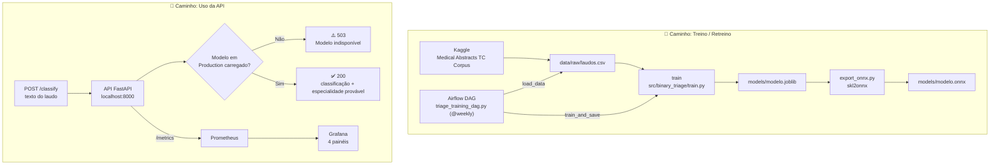

# medical-triage-mlops

Sistema de triagem automática de laudos médicos (NLP), servido via API REST em container Docker, com pipeline de CI/CD (GitHub Actions), orquestração de retreino (Airflow), monitoramento (Prometheus + Grafana) e otimização de latência (ONNX). Projeto desenvolvido para o Tech Challenge da Fase 3 do curso de Machine Learning Engineering da FIAP.

Para um resumo rápido, também temos um 🎥 Vídeo Explicativo em menos de 5 min (método STAR): `[A PREENCHER]`

---


## 👥 Integrantes

| Nome | RM | Contato |
|--|--|--|
| Gustavo Dell Anhol Oliveira | RM372138 | [Github](https://github.com/gudaoliveira) - [Linkedin](https://www.linkedin.com/in/gustavodell/) |
| Patrick Kwan | RM373172 | [Github](https://github.com/ptkwan) - [Linkedin](https://www.linkedin.com/in/patrick-kwan-617296220/) |

## 📋 Requisitos

- Python 3.12 ou 3.13
- `uv` instalado para gerenciamento de dependências
    - Aprenda como instalar o `uv` [aqui](https://docs.astral.sh/uv/getting-started/installation/)
- Docker + Docker Compose (para subir a stack de API + Prometheus + Grafana)
- `Makefile` para comandos de conveniência (opcional, mas recomendado)
    - No Windows, você pode usar o [Windows Subsystem for Linux (WSL)](https://learn.microsoft.com/en-us/windows/wsl/install) para acessar o `Makefile`.

## ⚙️ Setup

Realize o clone do repositório com

```bash
git clone https://github.com/gudaoliveira/medical-triage-mlops

cd medical-triage-mlops
```

Crie o ambiente virtual

```bash
uv venv

#############################################
# Para acessar o ambiente virtual
Windows 		-> .venv\Scripts\activate
Linux / macOS 	-> source .venv/bin/activate
```

Instale as dependências com:

```bash
# (para dependências de produção)
uv sync

# (para dependências de desenvolvimento: lint, testes e type-check)
uv sync --extra dev --extra lint --extra test --extra typecheck
```

## 📁 Organização do projeto

```
├── Dockerfile              <- Build multi-stage (base -> builder -> runtime) da API
├── docker-compose.yml      <- Orquestra api + prometheus + grafana
├── dags
│   └── triage_training_dag.py <- DAG Airflow: load_data -> train_and_save
├── LICENSE                 <- Licença open-source do projeto
├── Makefile                <- Comandos utilitários (`make test`, `make lint`, `make check`)
├── README.md               <- README principal para desenvolvedores do projeto
│
├── data
│   └── raw
│       └── laudos.csv       <- Dataset processado (texto + especialidade)
│
├── docs
│   ├── deploy_architecture.md  <- Arquitetura da API, estratégia de deploy em nuvem e limitações
│   ├── monitoring.md            <- Métricas expostas, dashboard Grafana e como subir a stack
│   ├── onnx_optimization.md     <- Exportação ONNX, benchmark de latência e limitações
│   └── retraining_pipeline.md   <- Funcionamento e decisões da DAG de retreino
│
├── models                  <- Artefatos de modelo (`modelo.joblib`, `modelo.onnx`)
│
├── notebooks               <- Jupyter notebooks: EDA e análise da triagem binária
│
├── observability
│   ├── prometheus.yml       <- Configuração de scrape do Prometheus
│   └── grafana
│       ├── dashboards/       <- Dashboard "Medical Triage - Overview" provisionado
│       └── provisioning/     <- Datasource e provisioning automático do Grafana
│
├── pyproject.toml          <- Configuração do projeto: dependências (uv) e ferramentas (ruff, pytest)
│
├── src                     <- Código-fonte principal do projeto
│   ├── config
│   │   └── settings.py      <- Settings (Pydantic) com o caminho do modelo
│   │
│   ├── api
│   │   ├── api.py           <- Aplicação FastAPI (lifespan carrega o modelo no startup)
│   │   ├── inference.py     <- Carregamento do modelo e função `classify`
│   │   ├── metrics.py       <- Métricas Prometheus (`http_requests_total`, latências, etc.)
│   │   ├── middleware.py    <- Logging de método/path/status/latência por requisição
│   │   ├── routes.py        <- `/health`, `/classify`, `/metrics`
│   │   └── schemas.py       <- Schemas Pydantic de request/response
│   │
│   └── binary_triage
│       ├── dataset.py        <- Baixa (kagglehub) e prepara `data/raw/laudos.csv`
│       ├── features.py       <- Features estruturadas de texto (TextMetaFeatures)
│       ├── train.py          <- Compara candidatos, calibra threshold e salva `modelo.joblib`
│       ├── model_wrapper.py  <- `ThresholdedBinaryClassifier` (threshold + sub-classificador)
│       ├── predict.py        <- Inferência via linha de comando sobre o modelo treinado
│       ├── export_onnx.py    <- Exporta os pipelines treinados para ONNX
│       ├── benchmark_onnx.py <- Compara latência scikit-learn vs. ONNX Runtime (p50/p95/p99)
│       └── eda.py            <- Utilitários de análise exploratória usados nos notebooks
│
└── tests                   <- Testes automatizados (pytest), markers unit/api/slow
```

## 📚 Documentações

- [Arquitetura de Deploy](docs/deploy_architecture.md) — arquitetura da API, estratégia de deploy em nuvem (real-time vs. batch, provider recomendado) e limitações atuais
- [Monitoramento e Observabilidade](docs/monitoring.md) — métricas expostas, como subir a stack (Docker Compose) e o dashboard Grafana
- [Otimização de Latência (ONNX)](docs/onnx_optimization.md) — exportação para ONNX, resultado do benchmark de latência e limitações
- [Pipeline de Retreino (Airflow)](docs/retraining_pipeline.md) — funcionamento da DAG e decisões de design

## 🔄 Fluxograma do projeto



Um hospital recebe laudos em texto livre e precisa decidir rapidamente se um caso pode seguir para um **clínico geral** ou se deve ser encaminhado direto para um **especialista** (oncologia, cardiologia, neurologia, gastroenterologia). O `ThresholdedBinaryClassifier` treinado em `src/binary_triage/train.py` automatiza essa primeira decisão e, quando o caso é `ESPECIALISTA`, já indica a especialidade mais provável — reduzindo o tempo até o laudo chegar na fila certa.

Duas formas de mexer no sistema: **retreinar o modelo** (via DAG do Airflow ou rodando `train.py` manualmente) ou **consumir a API** diretamente — a API sempre carrega o `.joblib` mais recente no startup.

## 🚀 Execução do projeto

Depois do [Setup](#️-setup):

```bash
# treinar o modelo (gera models/modelo.joblib)
uv run python -m src.binary_triage.train

# subir API + Prometheus + Grafana
docker compose up --build
```

| Serviço | URL | Descrição |
|---|---|---|
| API | http://localhost:8000 | `/health`, `/classify`, `/metrics`, `/docs` |
| Prometheus | http://localhost:9090 | Scrape de `api:8000/metrics` a cada 15s |
| Grafana | http://localhost:3000 | Login `admin`/`admin` — dashboard "Medical Triage - Overview" já provisionado |

**CI/CD.** `.github/workflows/ci.yml` roda a cada push/PR: lint e format (Ruff), type check (`ty`), testes (pytest, Python 3.12 e 3.13), build da imagem Docker e cobertura agregada no summary. Um job final (`all-checks-pass`) bloqueia merge se qualquer etapa falhar.

**Orquestração (Airflow).** `dags/triage_training_dag.py` — DAG semanal (`@weekly`) via TaskFlow API, com duas tasks: `load_data` (garante `data/raw/laudos.csv`, baixando do Kaggle só se necessário) e `train_and_save` (roda o pipeline de treino completo e sobrescreve `models/modelo.joblib`). Reaproveita os mesmos módulos do treino manual — sem lógica duplicada.

**Monitoramento.** A API expõe métricas Prometheus em `/metrics`: total de requisições, latência HTTP, classificações por classe e latência isolada da inferência (sem overhead de rede). Dashboard Grafana provisionado automaticamente com 4 painéis — classificações por classe, latência de inferência (p50/p95), requests HTTP por status e latência HTTP total.

**Otimização de latência (ONNX).** Os dois pipelines internos do modelo (decisão binária e sub-classificação de especialidade) são exportados para ONNX via `skl2onnx` e comparados contra o scikit-learn puro (`src/binary_triage/benchmark_onnx.py`, 300 chamadas após warmup):

| | p50 | p95 | p99 |
|---|---|---|---|
| scikit-learn | 2,69 ms | 4,87 ms | 7,91 ms |
| ONNX Runtime | 0,16 ms | 0,44 ms | 0,83 ms |

**Speedup no p50: ~16,4x.** Medição local (CPU, sem rede real) — ver [`docs/onnx_optimization.md`](docs/onnx_optimization.md) para detalhes e limitações.

## Licença

MIT — ver [LICENSE](LICENSE).
