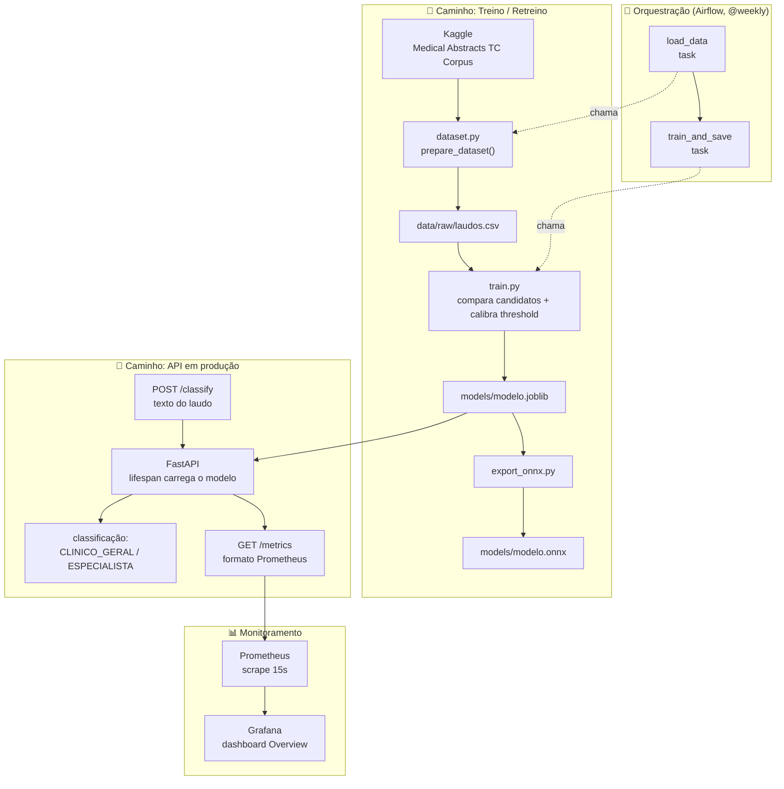

# Medical Triage MLOps

Sistema de triagem automática de laudos médicos (NLP) para classificar urgência, desenvolvido para o Tech Challenge da Fase 3 do curso de Machine Learning Engineering da FIAP. O foco do projeto é o **ciclo de vida do modelo em produção**: API de inferência em FastAPI containerizada com Docker, pipeline CI/CD via GitHub Actions, retreino orquestrado por uma DAG do Airflow, monitoramento com Prometheus + Grafana e otimização de latência via exportação para ONNX Runtime.

Vídeo Explicativo (método STAR, ≤5 min): `[A PREENCHER]`

---


## 👥 Integrantes

| Nome | RM | Contato |
|--|--|--|
| Gustavo Dell Anhol Oliveira | RM372138 | [Github](https://github.com/gudaoliveira) - [Linkedin](https://www.linkedin.com/in/gustavodell/) |
| Patrick Kwan | RM373172 | [Github](https://github.com/ptkwan) - [Linkedin](https://www.linkedin.com/in/patrick-kwan-617296220/) |

## 📋 Requisitos

- Python 3.12 ou 3.13
- `uv` instalado para gerenciamento de dependências
    - Aprenda como instalar o `uv` [aqui](https://docs.astral.sh/uv/getting-started/installation/)
- Docker + Docker Compose (para subir a stack de API + Prometheus + Grafana)
- `Makefile` para comandos de conveniência (opcional, mas recomendado)
    - No Windows, você pode usar o [Windows Subsystem for Linux (WSL)](https://learn.microsoft.com/en-us/windows/wsl/install) para acessar o `Makefile`.

## ⚙️ Setup

Realize o clone do repositório com

```bash
git clone https://github.com/gudaoliveira/medical-triage-mlops

cd medical-triage-mlops
```

Crie o ambiente virtual

```bash
uv venv

#############################################
# Para acessar o ambiente virtual
Windows 		-> .venv\Scripts\activate
Linux / macOS 	-> source .venv/bin/activate
```

Instale as dependências com:

```bash
# (para dependências de produção)
uv sync

# (para dependências de desenvolvimento: lint, testes e type-check)
uv sync --extra dev --extra lint --extra test --extra typecheck
```

## 📁 Organização do projeto

```
├── Dockerfile              <- Build multi-stage (base -> builder -> runtime) da API
├── docker-compose.yml      <- Orquestra api + prometheus + grafana
├── dags
│   └── triage_training_dag.py <- DAG Airflow: load_data -> train_and_save
├── LICENSE                 <- Licença open-source do projeto
├── Makefile                <- Comandos utilitários (`make test`, `make lint`, `make check`)
├── README.md               <- README principal para desenvolvedores do projeto
│
├── data
│   └── raw
│       └── laudos.csv       <- Dataset processado (texto + especialidade), gerado por dataset.py
│
├── docs
│   ├── deploy_architecture.md  <- Arquitetura da API, estratégia de deploy em nuvem e limitações
│   ├── monitoring.md            <- Métricas expostas, dashboard Grafana e como subir a stack
│   ├── onnx_optimization.md     <- Exportação ONNX, benchmark de latência e limitações
│   └── retraining_pipeline.md   <- Funcionamento e decisões da DAG de retreino
│
├── models                  <- Artefatos de modelo (`modelo.joblib`, `modelo.onnx`)
│
├── notebooks               <- Jupyter notebooks: EDA e análise da triagem binária
│
├── observability
│   ├── prometheus.yml       <- Configuração de scrape do Prometheus
│   └── grafana
│       ├── dashboards/       <- Dashboard "Medical Triage - Overview" provisionado
│       └── provisioning/     <- Datasource e provisioning automático do Grafana
│
├── pyproject.toml          <- Configuração do projeto: dependências (uv) e ferramentas (ruff, pytest)
│
├── src                     <- Código-fonte principal do projeto
│   ├── config
│   │   └── settings.py      <- Settings (Pydantic) com o caminho do modelo
│   │
│   ├── api
│   │   ├── api.py           <- Aplicação FastAPI (lifespan carrega o modelo no startup)
│   │   ├── inference.py     <- Carregamento do modelo e função `classify`
│   │   ├── metrics.py       <- Métricas Prometheus (`http_requests_total`, latências, etc.)
│   │   ├── middleware.py    <- Logging de método/path/status/latência por requisição
│   │   ├── routes.py        <- `/health`, `/classify`, `/metrics`
│   │   └── schemas.py       <- Schemas Pydantic de request/response
│   │
│   └── binary_triage
│       ├── dataset.py        <- Baixa (kagglehub) e prepara `data/raw/laudos.csv`
│       ├── features.py       <- Features estruturadas de texto (TextMetaFeatures)
│       ├── train.py          <- Compara candidatos, calibra threshold e salva `modelo.joblib`
│       ├── model_wrapper.py  <- `ThresholdedBinaryClassifier` (threshold + sub-classificador)
│       ├── predict.py        <- Inferência via linha de comando sobre o modelo treinado
│       ├── export_onnx.py    <- Exporta os pipelines treinados para ONNX
│       ├── benchmark_onnx.py <- Compara latência scikit-learn vs. ONNX Runtime (p50/p95/p99)
│       ├── compare_twostage.py <- Comparação do candidato final com uma abordagem alternativa
│       └── eda.py            <- Utilitários de análise exploratória usados nos notebooks
│
└── tests                   <- Testes automatizados (pytest), markers unit/api/slow
```

## 📚 Documentações

- [Arquitetura de Deploy](docs/deploy_architecture.md) — arquitetura da API, estratégia de deploy em nuvem (real-time vs. batch, provider recomendado) e limitações atuais
- [Monitoramento e Observabilidade](docs/monitoring.md) — métricas expostas, como subir a stack (Docker Compose) e o dashboard Grafana
- [Otimização de Latência (ONNX)](docs/onnx_optimization.md) — exportação para ONNX, resultado do benchmark de latência e limitações
- [Pipeline de Retreino (Airflow)](docs/retraining_pipeline.md) — funcionamento da DAG e decisões de design

## 🔄 Fluxograma do projeto



## 🚀 Execução do projeto

Depois do [Setup](#️-setup), existem dois caminhos possíveis — treinar o modelo do zero ou apenas subir a API com o modelo já versionado em `models/` (ver [Fluxograma](#-fluxograma-do-projeto)).

**O projeto roda de ponta a ponta sem nenhuma credencial externa.** O dataset (Medical Abstracts TC Corpus) é baixado publicamente via `kagglehub`, sem necessidade de login.

### 1. (Opcional) Obter o dataset e treinar o modelo

Se `data/raw/laudos.csv` ou `models/modelo.joblib` ainda não existirem, ou se você quiser retreinar:

```bash
uv run python -m src.binary_triage.dataset
uv run python -m src.binary_triage.train
```

Isso baixa e prepara o dataset, compara os candidatos de modelo, calibra o threshold de decisão e salva `models/modelo.joblib`.

### 2. (Opcional) Exportar para ONNX e comparar latência

```bash
uv run python -m src.binary_triage.export_onnx
uv run python -m src.binary_triage.benchmark_onnx
```

Gera `models/modelo.onnx`/`models/specialty.onnx` e `models/reports/onnx_benchmark.json` com a comparação p50/p95/p99 entre scikit-learn e ONNX Runtime — resultado documentado em [docs/onnx_optimization.md](docs/onnx_optimization.md).

### 3. Subir a stack completa (API + Prometheus + Grafana)

```bash
docker compose up --build
```

- API: `http://localhost:8000` (`/health`, `/classify`, `/metrics`; documentação interativa em `/docs`)
- Prometheus: `http://localhost:9090`
- Grafana: `http://localhost:3000` (login `admin`/`admin`, ou acesso anônimo como Viewer) — dashboard "Medical Triage - Overview" já provisionado

Detalhes das métricas expostas e dos painéis em [docs/monitoring.md](docs/monitoring.md).

### 4. Testar a API

```bash
curl http://localhost:8000/health
```

```json
{"status": "ok"}
```

```bash
curl -X POST http://localhost:8000/classify \
  -H "Content-Type: application/json" \
  -d '{"texto": "Paciente relata dor torácica intensa há 2 horas, irradiando para o braço esquerdo."}'
```

### 5. (Opcional) Testar a DAG de retreino localmente

Sem subir scheduler/webserver, só validando a DAG de ponta a ponta:

```bash
export AIRFLOW_HOME=.airflow
airflow db migrate
airflow dags test triage_training_dag
```

Detalhes das decisões de design da DAG em [docs/retraining_pipeline.md](docs/retraining_pipeline.md).

### 6. Parar os serviços

```bash
docker compose down
```

## ✅ Testes e validação

```bash
make test
```

Equivalente a `pytest tests/ -v --no-cov -m "not slow"` — roda tudo exceto os testes marcados como lentos.

Para rodar com relatório de cobertura (mínimo exigido: 70% sobre `src/`, ver `pyproject.toml`):

```bash
make test-cov
```

### Markers disponíveis

| Marker | O que cobre |
| --- | --- |
| `unit` | Testes unitários (padrão da maioria dos módulos) |
| `api` | Endpoints FastAPI (`/health`, `/classify`) |
| `slow` | Testes mais pesados (ex.: exportação ONNX), excluídos do `make test` padrão |

### CI

`.github/workflows/ci.yml` roda em todo push/PR para `main`: lint e format (`ruff`), type-check (`ty`), testes com cobertura em Python 3.12 e 3.13, e build da imagem Docker (`docker build --target runtime`), com um gate final (`all-checks-pass`) que bloqueia o merge se qualquer job falhar.

## 🔧 Pontos de melhoria

Durante o desenvolvimento do projeto, algumas decisões foram tomadas visando a entrega dentro do prazo, mas que poderiam ser melhoradas com mais tempo, como por exemplo:

- Vídeo STAR ainda não gravado — `[A PREENCHER]`.
- O modelo ONNX exportado (16.4x mais rápido no p50, ver [docs/onnx_optimization.md](docs/onnx_optimization.md)) não está integrado à API de inferência — a API ainda serve via scikit-learn puro; trocar o motor de inferência em produção ficou definido como escopo de uma branch/PR separado.
- O CI (`ci.yml`) builda a imagem Docker mas não a publica em nenhum registry — a validação do `docker-compose.yml` completo hoje é manual.
- A DAG do Airflow foi validada localmente via `airflow dags test`, mas não há um Airflow (scheduler/webserver) rodando de fato no `docker-compose.yml`.
- Sem deploy em nuvem de fato — a estratégia está decidida e documentada ([docs/deploy_architecture.md](docs/deploy_architecture.md)), mas falta o provisionamento real de infraestrutura.
- A API não tem autenticação, rate limiting nem versionamento de endpoint (ver [Arquitetura de Deploy](docs/deploy_architecture.md)).
- Sem alertas configurados no Grafana/Prometheus (Alertmanager) e sem métrica de drift de dados de entrada.
